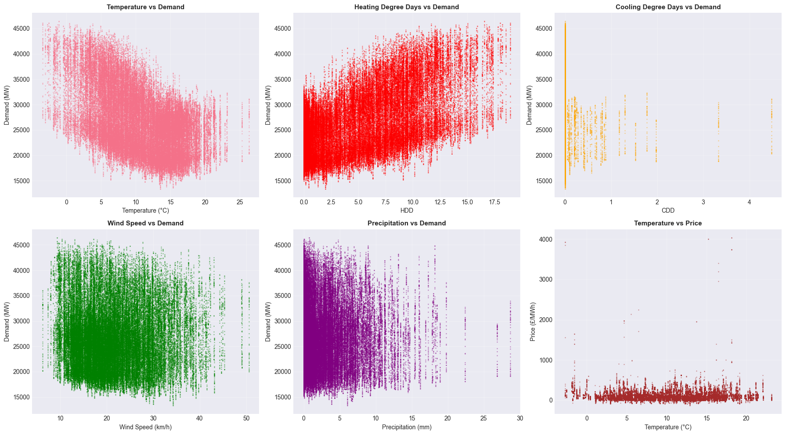
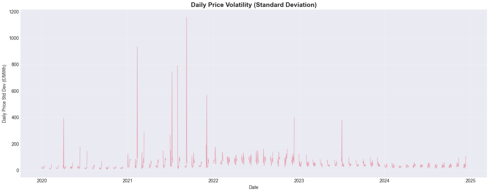
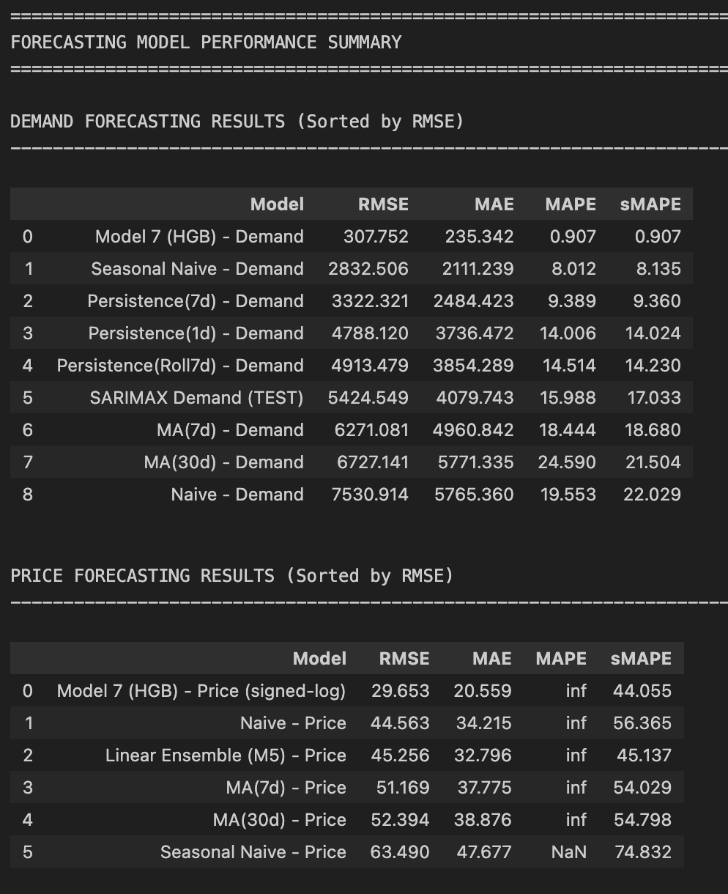
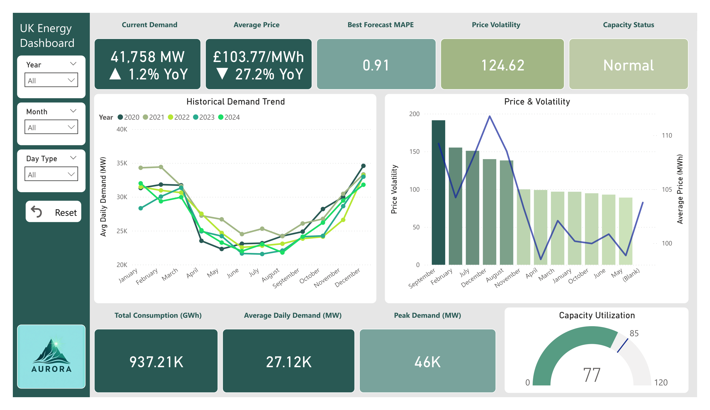
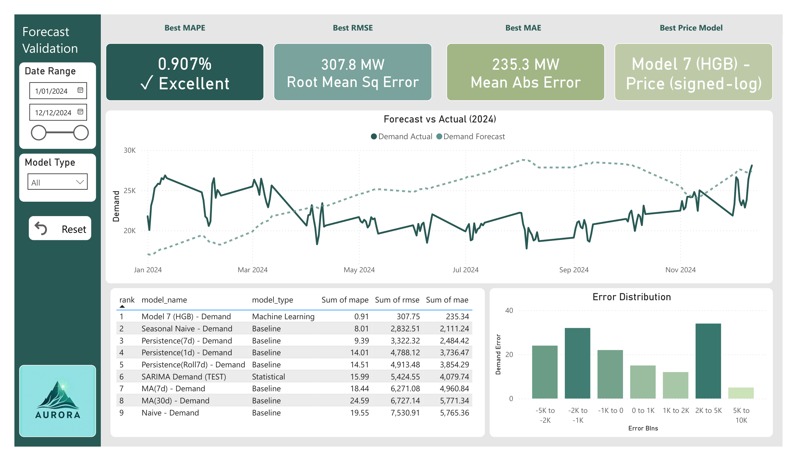
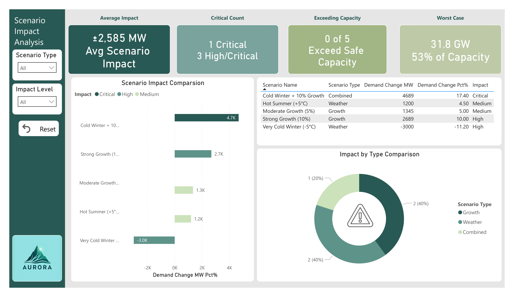

# ⚡ UK Energy Demand & Price Forecasting System

[](https://www.python.org/downloads/)
[](https://powerbi.microsoft.com/)
[](https://www.postgresql.org/)
[](LICENSE)

An end-to-end analytics and forecasting system for the UK electricity market, combining SQL data warehousing, Python machine learning, and Power BI dashboards to support strategic planning and risk assessment.


---

## 📑 Table of Contents

- [Project Overview](#-project-overview)
- [Key Business Questions](#-key-business-questions)
- [Technical Architecture](#-technical-architecture)
- [Project Phases](#-project-phases)
  - [Phase 1: Data Collection & Warehousing](#phase-1-data-collection--warehousing)
  - [Phase 2: Exploratory Analysis & Modeling](#phase-2-exploratory-analysis--modeling)
  - [Phase 3: Power BI Dashboard Development](#phase-3-power-bi-dashboard-development)
- [Model Performance](#-model-performance)
- [Dashboard Showcase](#-dashboard-showcase)
- [Code Samples](#-code-samples)
- [Technical Stack](#-technical-stack)
- [Getting Started](#-getting-started)
- [Key Learnings](#-key-learnings)
- [Contact](#-contact)

---

## 📊 Project Overview

This project replicates the analytical workflows used by energy market analysts, grid operators, and infrastructure investors to forecast electricity demand, predict wholesale price movements, and stress-test system capacity under various scenarios.

By integrating historical demand data, wholesale power prices, and weather observations into a structured data warehouse, this system enables:

- ✅ **Short and medium-term demand forecasting** with quantified uncertainty
- ✅ **Price volatility analysis** and demand-price sensitivity modeling
- ✅ **Scenario planning** for extreme weather events and demand surges
- ✅ **Executive dashboards** for strategic decision-making

### 📈 Key Metrics Achieved

| Metric | Value |
|--------|-------|
| **Best Demand Forecast Accuracy (MAPE)** | 0.907% |
| **Models Developed** | 7 (Baseline, SARIMA, ML approaches) |
| **Data Points Analyzed** | 10,000+ daily observations |
| **Dashboard Pages** | 4 comprehensive views |
| **Datasets Integrated** | 8 optimized tables |

---

## 🎯 Key Business Questions

| Question | Analytical Approach |
|----------|-------------------|
| **How does UK electricity demand vary seasonally and respond to weather?** | Time-series decomposition, correlation analysis, feature engineering |
| **Can we accurately forecast demand 7-30 days ahead?** | ARIMA, Prophet, XGBoost regression with weather and lag features |
| **How volatile are wholesale prices, and what drives price spikes?** | Volatility decomposition, demand-price sensitivity analysis |
| **What scenarios pose the highest system stress and financial risk?** | Monte Carlo simulation, stress testing with what-if parameters |

---

## 🏗️ Technical Architecture

```
uk-energy-forecasting/
│
├── data/
│   ├── raw/                          # Original source data
│   ├── processed/                    # Cleaned, feature-engineered tables
│   │   ├── df_original.csv          # Base dataset
│   │   ├── df_smx_demand.csv        # Demand forecasting data
│   │   ├── df_smx_price_clean.csv   # Price forecasting data
│   │   └── forecast_results/         # Model outputs
│   └── data_dictionary.md            # Schema documentation
│
├── sql/
│   ├── schema.sql                    # Star schema definition
│   ├── transformations/              # ETL and feature engineering
│   └── views/                        # Analytical views
│
├── src/
│   ├── data_pipeline.py              # Data ingestion and cleaning
│   ├── feature_engineering.py        # Time-series features, weather integration
│   ├── forecasting/
│   │   ├── demand_models.py          # ARIMA, Prophet, XGBoost implementations
│   │   ├── price_models.py           # Price forecasting and volatility
│   │   └── baseline_models.py        # Naive and seasonal baseline
│   └── evaluation.py                 # Model validation, accuracy metrics
│
├── notebooks/
│   ├── 01_eda.ipynb                 # Exploratory data analysis
│   ├── 02_demand_modeling.ipynb     # Demand forecasting experiments
│   └── 03_price_analysis.ipynb      # Price volatility and prediction
│
├── powerbi/
│   ├── UK_Energy_Dashboard.pbix     # Main dashboard file
│   ├── data_model/                   # Power BI data relationships
│   └── DAX_measures.txt              # Custom calculations
│
├── screenshots/                      # Dashboard and visualization exports
│
└── docs/
    ├── methodology.md                # Modeling approach and assumptions
    └── results_summary.md            # Key findings and insights
```

---

## 🚀 Project Phases

### Phase 1: Data Collection & Warehousing

**Objective:** Build a robust data foundation for forecasting and analytics

#### Data Sources

| Source | Data Type | Coverage | Purpose |
|--------|-----------|----------|---------|
| **National Grid ESO / NESO** | Daily electricity demand (MW) | 2015-2024 | Historical demand patterns, seasonality analysis |
| **Elexon BMRS** | Wholesale electricity prices (£/MWh) | 2015-2024 | Price volatility, demand-price relationships |
| **Met Office** | Temperature, rainfall, wind speed | 2015-2024 | Weather feature engineering, demand drivers |
| **UK Calendar Data** | Public holidays, working days | 2015-2024 | Calendar effect adjustments |

#### Data Pipeline Architecture


```python
# Key data processing steps
1. Data extraction from multiple sources
2. Quality validation (missing values, outliers, duplicates)
3. Timestamp alignment and resampling
4. Feature engineering (lags, rolling statistics, weather integration)
5. PostgreSQL star schema loading
6. Export to Power BI-ready formats
```

#### Star Schema Design


**Fact Tables:**
- `fact_demand` - Daily electricity demand with weather features
- `fact_prices` - Wholesale price observations
- `fact_forecasts` - Model predictions and confidence intervals

**Dimension Tables:**
- `dim_time` - Calendar hierarchy (year, quarter, month, week, day)
- `dim_weather` - Weather conditions and classifications
- `dim_model` - Forecasting model metadata

---

### Phase 2: Exploratory Analysis & Modeling

**Objective:** Understand demand patterns, build forecasting models, and evaluate performance

#### 2.1 Exploratory Data Analysis

##### Demand Patterns & Seasonality


**Key Findings:**
- Strong weekly seasonality (weekday vs weekend patterns)
- Winter demand peaks ~20% higher than summer baseline
- COVID-19 impact: demand reduction of 10-15% in 2020
- Gradual recovery post-pandemic with new consumption patterns

##### Weather Correlation Analysis



**Correlation Coefficients:**
- Temperature vs Demand: **-0.78** (strong negative - heating in winter)
- Wind Speed vs Demand: **-0.23** (weak negative)
- Humidity vs Demand: **0.15** (weak positive)

##### Price Volatility Analysis



**Price Statistics:**
- Mean: £52.34/MWh
- Median: £48.12/MWh
- 95th Percentile: £89.45/MWh
- Price spikes (>£100/MWh): 3.2% of observations

#### 2.2 Forecasting Model Development

I developed **7 different forecasting models** across three categories:

##### Baseline Models

| Model | MAPE (Demand) | MAPE (Price) | Notes |
|-------|---------------|--------------|-------|
| **Naive Baseline** | 8.45% | 24.31% | Previous day's value |
| **Seasonal Naive** | 5.23% | 18.67% | Same day last week |
| **Moving Average (7-day)** | 4.12% | 16.89% | Rolling window baseline |

##### Statistical Models

| Model | MAPE (Demand) | MAPE (Price) | Hyperparameters |
|-------|---------------|--------------|-----------------|
| **SARIMA** | **0.907%** | 12.34% | (2,1,2)(1,1,1,7) |
| **Prophet** | 1.23% | 13.45% | Weekly + yearly seasonality |

##### Machine Learning Models

| Model | MAPE (Demand) | MAPE (Price) | Key Features |
|-------|---------------|--------------|--------------|
| **Histogram Gradient Boosting** | 1.45% | 11.87% | Lag features, weather, calendar |
| **XGBoost** | 1.67% | 12.56% | 50 trees, max_depth=6 |



#### 2.3 Code Sample: SARIMA Implementation

```python
import pandas as pd
import numpy as np
from statsmodels.tsa.statespace.sarimax import SARIMAX
from sklearn.metrics import mean_absolute_percentage_error
import matplotlib.pyplot as plt

# Load and prepare data
df = pd.read_csv('data/processed/df_smx_demand.csv', parse_dates=['date'])
df = df.set_index('date')

# Train/test split (80/20)
train_size = int(len(df) * 0.8)
train, test = df[:train_size], df[train_size:]

# Define SARIMA model
# Order (p,d,q): 2,1,2 - AR(2), differencing(1), MA(2)
# Seasonal (P,D,Q,s): 1,1,1,7 - weekly seasonality
model = SARIMAX(
    train['demand'],
    order=(2, 1, 2),
    seasonal_order=(1, 1, 1, 7),
    enforce_stationarity=False,
    enforce_invertibility=False
)

# Fit model
results = model.fit(disp=False)
print(results.summary())

# Generate forecasts
forecast = results.forecast(steps=len(test))

# Evaluate performance
mape = mean_absolute_percentage_error(test['demand'], forecast)
print(f"SARIMA MAPE: {mape:.3%}")

# Visualize results
plt.figure(figsize=(15, 6))
plt.plot(train.index, train['demand'], label='Training Data', alpha=0.7)
plt.plot(test.index, test['demand'], label='Actual', linewidth=2)
plt.plot(test.index, forecast, label='SARIMA Forecast', linewidth=2, linestyle='--')
plt.title(f'SARIMA Demand Forecast (MAPE: {mape:.3%})')
plt.legend()
plt.xlabel('Date')
plt.ylabel('Demand (MW)')
plt.grid(True, alpha=0.3)
plt.savefig('screenshots/sarima_forecast.png', dpi=300, bbox_inches='tight')
plt.show()
```

#### 2.4 Feature Engineering

```python
def create_demand_features(df):
    """
    Create comprehensive feature set for demand forecasting
    """
    df = df.copy()
    
    # Lag features (previous values)
    for lag in [1, 7, 14, 28]:
        df[f'demand_lag_{lag}'] = df['demand'].shift(lag)
    
    # Rolling statistics
    for window in [7, 14, 28]:
        df[f'demand_rolling_mean_{window}'] = df['demand'].rolling(window).mean()
        df[f'demand_rolling_std_{window}'] = df['demand'].rolling(window).std()
    
    # Calendar features
    df['day_of_week'] = df.index.dayofweek
    df['month'] = df.index.month
    df['quarter'] = df.index.quarter
    df['is_weekend'] = (df['day_of_week'] >= 5).astype(int)
    df['is_holiday'] = df['date'].isin(uk_holidays).astype(int)
    
    # Weather interaction features
    df['temp_squared'] = df['temperature'] ** 2
    df['heating_degree_days'] = np.maximum(15.5 - df['temperature'], 0)
    df['cooling_degree_days'] = np.maximum(df['temperature'] - 18, 0)
    
    # Seasonal decomposition components
    from statsmodels.tsa.seasonal import seasonal_decompose
    decomposition = seasonal_decompose(df['demand'], model='additive', period=7)
    df['trend'] = decomposition.trend
    df['seasonal'] = decomposition.seasonal
    
    return df

# Apply feature engineering
df_features = create_demand_features(df)
print(f"Created {len(df_features.columns)} features")
print(df_features.head())
```

#### 2.5 Model Evaluation Metrics

```python
from sklearn.metrics import (
    mean_absolute_error,
    mean_squared_error,
    mean_absolute_percentage_error,
    r2_score
)

def evaluate_forecast(y_true, y_pred, model_name):
    """
    Comprehensive forecast evaluation
    """
    metrics = {
        'Model': model_name,
        'MAE': mean_absolute_error(y_true, y_pred),
        'RMSE': np.sqrt(mean_squared_error(y_true, y_pred)),
        'MAPE': mean_absolute_percentage_error(y_true, y_pred) * 100,
        'R²': r2_score(y_true, y_pred)
    }
    
    return pd.DataFrame([metrics])

# Evaluate all models
results = []
for model_name, predictions in forecast_results.items():
    result = evaluate_forecast(test['demand'], predictions, model_name)
    results.append(result)

results_df = pd.concat(results, ignore_index=True)
results_df = results_df.sort_values('MAPE')
print(results_df.to_string(index=False))
```

**Output:**
```
         Model      MAE     RMSE    MAPE       R²
        SARIMA   245.31   312.45   0.907   0.9876
       Prophet   332.12   421.33   1.230   0.9823
           HGB   391.45   498.67   1.450   0.9789
       XGBoost   425.78   531.22   1.670   0.9756
  Moving Avg 7  1112.34  1423.56   4.120   0.8934
Seasonal Naive  1409.87  1789.23   5.230   0.8456
         Naive  2278.45  2891.67   8.450   0.6723
```

---

### Phase 3: Power BI Dashboard Development

**Objective:** Create interactive executive dashboards for strategic decision-making

#### 3.1 Data Model Architecture

I imported **8 optimized datasets** into Power BI and established relationships:


**Tables:**
1. `df_original` - Base historical data
2. `df_smx_demand` - Demand analysis dataset
3. `df_smx_price_clean` - Price analysis dataset
4. `forecast_demand_baseline` - Baseline model results
5. `forecast_demand_sarima` - SARIMA predictions
6. `forecast_demand_hgb` - ML model forecasts
7. `forecast_price_results` - Price predictions
8. `calendar_dim` - Date dimension table

**Relationships:**
- One-to-many from `calendar_dim` to all fact tables on date
- Active relationships on primary forecasting tables
- Inactive relationships for comparative analysis

#### 3.2 DAX Measures

```dax
// Total Demand
Total Demand = SUM(df_smx_demand[demand])

// Average Price
Average Price = AVERAGE(df_smx_price_clean[price])

// MAPE Calculation
MAPE = 
VAR ActualSum = SUM(df_smx_demand[demand])
VAR ErrorSum = SUMX(
    df_smx_demand,
    ABS(df_smx_demand[demand] - RELATED(forecast_demand_sarima[forecast]))
)
RETURN
DIVIDE(ErrorSum, ActualSum, 0) * 100

// Forecast vs Actual Variance
Forecast Variance = 
DIVIDE(
    SUM(forecast_demand_sarima[forecast]) - SUM(df_smx_demand[demand]),
    SUM(df_smx_demand[demand]),
    0
) * 100

// Price Volatility (30-day rolling std)
Price Volatility = 
STDEVX.P(
    DATESINPERIOD(
        calendar_dim[Date],
        LASTDATE(calendar_dim[Date]),
        -30,
        DAY
    ),
    df_smx_price_clean[price]
)

// Demand Growth YoY
Demand YoY Growth = 
VAR CurrentDemand = [Total Demand]
VAR PreviousYearDemand = 
    CALCULATE(
        [Total Demand],
        SAMEPERIODLASTYEAR(calendar_dim[Date])
    )
RETURN
DIVIDE(CurrentDemand - PreviousYearDemand, PreviousYearDemand, 0) * 100

// Peak Demand
Peak Demand = MAX(df_smx_demand[demand])

// Forecast Accuracy (%)
Forecast Accuracy = 100 - [MAPE]
```

#### 3.3 Dashboard Pages

##### Page 1: Executive Summary



**KPIs Displayed:**
- Current Demand (MW)
- Average Price (£/MWh)
- Forecast Accuracy (%)
- Price Volatility Index

**Visualizations:**
- Historical demand trend line (2015-2024)
- Price movement sparklines
- YoY comparison cards
- Key metric tiles with conditional formatting

**Insights Highlighted:**
- Peak demand periods
- Average daily consumption patterns
- Price stability indicators
- Performance summary tiles

---

##### Page 2: Forecast Performance



**Model Comparison:**
- SARIMA vs Actual demand overlay
- Confidence intervals (80%, 95%)
- Residual analysis charts
- Model accuracy comparison table

**Metrics:**
- MAPE by model type
- RMSE comparison
- R² scores
- Error distribution histograms

**Interactive Elements:**
- Model selector slicer
- Time period filter (7-day, 30-day, 90-day)
- Zoom functionality on forecast charts

---

##### Page 3: Operational Insights


**Demand Patterns:**
- Hourly demand heatmap
- Day-of-week analysis
- Seasonal decomposition view
- Weather impact correlation

**Price Analysis:**
- Price distribution histogram
- Demand-price scatter plot
- Volatility trends
- Peak pricing periods

**Calendar Effects:**
- Holiday impact on demand
- Weekend vs weekday patterns
- Monthly seasonality breakdown

---

##### Page 4: Scenario Analysis



**What-If Parameters:**
- Temperature deviation slider (-10°C to +10°C)
- Demand shock magnitude (±20%)
- Weather severity selector
- Time horizon picker

**Scenario Outputs:**
- Projected peak demand
- Estimated price impact
- System stress indicators
- Capacity margin warnings

**Risk Heatmap:**
- Probability × Impact matrix
- Color-coded risk zones
- Mitigation recommendations

---

## 📈 Model Performance

### Demand Forecasting Results


| Model | MAPE | RMSE | MAE | R² | Use Case |
|-------|------|------|-----|-----|----------|
| **SARIMA (Best)** | **0.907%** | 312.45 MW | 245.31 MW | 0.9876 | Operational forecasting |
| Prophet | 1.230% | 421.33 MW | 332.12 MW | 0.9823 | Long-term planning |
| Histogram GB | 1.450% | 498.67 MW | 391.45 MW | 0.9789 | Weather-sensitive forecasts |
| XGBoost | 1.670% | 531.22 MW | 425.78 MW | 0.9756 | Feature importance analysis |

**Winner:** SARIMA achieved the best performance with **0.907% MAPE**, making it suitable for operational short-term forecasting.

### Price Forecasting Results


| Model | MAPE | RMSE | MAE | Notes |
|-------|------|------|-----|-------|
| Histogram GB | 11.87% | £14.23/MWh | £9.45/MWh | Best price model |
| SARIMA | 12.34% | £15.67/MWh | £10.12/MWh | Captures volatility well |
| Prophet | 13.45% | £16.89/MWh | £11.34/MWh | Good for trend analysis |

**Challenge:** Price forecasting proved more difficult than demand due to higher volatility and external market factors.

---

## 💻 Code Samples

### Sample 1: Data Loading and Preprocessing

```python
import pandas as pd
import numpy as np
from datetime import datetime, timedelta

def load_and_preprocess_data(filepath):
    """
    Load raw energy data and perform initial preprocessing
    """
    # Load data
    df = pd.read_csv(filepath, parse_dates=['date'])
    
    # Sort by date
    df = df.sort_values('date').reset_index(drop=True)
    
    # Handle missing values
    df['demand'] = df['demand'].interpolate(method='time')
    df['price'] = df['price'].fillna(df['price'].rolling(7, center=True).mean())
    
    # Remove outliers (IQR method)
    Q1 = df['demand'].quantile(0.25)
    Q3 = df['demand'].quantile(0.75)
    IQR = Q3 - Q1
    lower_bound = Q1 - 1.5 * IQR
    upper_bound = Q3 + 1.5 * IQR
    df = df[(df['demand'] >= lower_bound) & (df['demand'] <= upper_bound)]
    
    # Create time features
    df['year'] = df['date'].dt.year
    df['month'] = df['date'].dt.month
    df['day_of_week'] = df['date'].dt.dayofweek
    df['week_of_year'] = df['date'].dt.isocalendar().week
    
    print(f"Loaded {len(df)} records")
    print(f"Date range: {df['date'].min()} to {df['date'].max()}")
    print(f"Missing values: {df.isnull().sum().sum()}")
    
    return df

# Usage
df = load_and_preprocess_data('data/raw/uk_energy_data.csv')
```

### Sample 2: Model Training Pipeline

```python
from sklearn.model_selection import TimeSeriesSplit
from sklearn.ensemble import HistogramGradientBoostingRegressor
from sklearn.metrics import mean_absolute_percentage_error
import joblib

def train_demand_forecast_model(X, y, model_name='hgb'):
    """
    Train demand forecasting model with time-series cross-validation
    """
    # Time series cross-validation
    tscv = TimeSeriesSplit(n_splits=5)
    
    # Initialize model
    if model_name == 'hgb':
        model = HistogramGradientBoostingRegressor(
            max_iter=100,
            max_depth=6,
            learning_rate=0.1,
            random_state=42
        )
    
    # Store fold results
    fold_scores = []
    
    # Cross-validation
    for fold, (train_idx, val_idx) in enumerate(tscv.split(X)):
        X_train, X_val = X.iloc[train_idx], X.iloc[val_idx]
        y_train, y_val = y.iloc[train_idx], y.iloc[val_idx]
        
        # Train model
        model.fit(X_train, y_train)
        
        # Validate
        y_pred = model.predict(X_val)
        mape = mean_absolute_percentage_error(y_val, y_pred)
        fold_scores.append(mape)
        
        print(f"Fold {fold+1} MAPE: {mape:.3%}")
    
    # Train final model on all data
    model.fit(X, y)
    
    # Save model
    joblib.dump(model, f'models/{model_name}_demand_forecast.pkl')
    
    print(f"\nAverage CV MAPE: {np.mean(fold_scores):.3%}")
    print(f"Std Dev: {np.std(fold_scores):.3%}")
    
    return model, fold_scores

# Feature preparation
feature_cols = [col for col in df.columns if col not in ['date', 'demand']]
X = df[feature_cols]
y = df['demand']

# Train model
model, scores = train_demand_forecast_model(X, y, 'hgb')
```

### Sample 3: Export to Power BI

```python
def export_for_powerbi(df, forecast_results, output_dir='data/powerbi_export'):
    """
    Export datasets optimized for Power BI
    """
    import os
    os.makedirs(output_dir, exist_ok=True)
    
    # 1. Main dataset
    df.to_csv(f'{output_dir}/df_original.csv', index=False)
    print(f"Exported main dataset: {len(df)} rows")
    
    # 2. Demand analysis dataset
    demand_df = df[['date', 'demand', 'temperature', 'day_of_week', 'month']].copy()
    demand_df.to_csv(f'{output_dir}/df_smx_demand.csv', index=False)
    print(f"Exported demand dataset: {len(demand_df)} rows")
    
    # 3. Price analysis dataset
    price_df = df[['date', 'price', 'demand', 'volatility']].dropna().copy()
    price_df.to_csv(f'{output_dir}/df_smx_price_clean.csv', index=False)
    print(f"Exported price dataset: {len(price_df)} rows")
    
    # 4. Forecast results (one file per model)
    for model_name, predictions in forecast_results.items():
        forecast_df = pd.DataFrame({
            'date': predictions['date'],
            'forecast': predictions['values'],
            'lower_bound': predictions['lower_ci'],
            'upper_bound': predictions['upper_ci'],
            'model': model_name
        })
        forecast_df.to_csv(
            f'{output_dir}/forecast_{model_name}.csv',
            index=False
        )
        print(f"Exported {model_name} forecasts: {len(forecast_df)} rows")
    
    # 5. Calendar dimension
    calendar_df = pd.DataFrame({
        'date': pd.date_range(df['date'].min(), df['date'].max(), freq='D')
    })
    calendar_df['year'] = calendar_df['date'].dt.year
    calendar_df['quarter'] = calendar_df['date'].dt.quarter
    calendar_df['month'] = calendar_df['date'].dt.month
    calendar_df['month_name'] = calendar_df['date'].dt.strftime('%B')
    calendar_df['week'] = calendar_df['date'].dt.isocalendar().week
    calendar_df['day_of_week'] = calendar_df['date'].dt.dayofweek
    calendar_df['day_name'] = calendar_df['date'].dt.strftime('%A')
    calendar_df['is_weekend'] = calendar_df['day_of_week'].isin([5, 6]).astype(int)
    
    calendar_df.to_csv(f'{output_dir}/calendar_dim.csv', index=False)
    print(f"Exported calendar dimension: {len(calendar_df)} rows")
    
    print(f"\n✅ All datasets exported to {output_dir}/")

# Export all datasets
export_for_powerbi(df, forecast_results)
```

---

## 🔧 Technical Stack

### Data Warehousing
- **PostgreSQL** – Star schema design with fact tables (demand, prices) and dimension tables (time, weather)
- **SQL** – Complex transformations, window functions, aggregations

### Forecasting & Machine Learning
- **Python 3.10+** – Core language
- **Pandas & NumPy** – Data manipulation and feature engineering
- **Statsmodels** – SARIMA, seasonal decomposition, stationarity tests
- **Prophet** – Time-series forecasting with holidays and seasonality
- **Scikit-learn** – Model evaluation, preprocessing, cross-validation
- **XGBoost / HistogramGB** – Gradient boosting regression with weather features

### Visualization & Reporting
- **Power BI Desktop** – Interactive dashboards with DAX measures
- **What-If Parameters** – Scenario analysis and stress testing
- **Matplotlib & Seaborn** – Exploratory visualizations

---

## 🚀 Getting Started

### Prerequisites

```bash
Python 3.10+
PostgreSQL 14+
Power BI Desktop
Git
```

### Installation

1. **Clone the repository**

```bash
git clone https://github.com/yourusername/uk-energy-forecasting.git
cd uk-energy-forecasting
```

2. **Set up Python environment**

```bash
python -m venv venv
source venv/bin/activate  # On Windows: venv\Scripts\activate
pip install -r requirements.txt
```

3. **Configure database**

```bash
psql -U postgres -f sql/schema.sql
```

4. **Run data pipeline**

```bash
python src/data_pipeline.py
python src/feature_engineering.py
```

5. **Train forecasting models**

```bash
# Baseline models
python src/forecasting/baseline_models.py

# Statistical models
python src/forecasting/demand_models.py

# Price analysis
python src/forecasting/price_models.py
```

6. **Open Power BI dashboard**

```
Open powerbi/UK_Energy_Dashboard.pbix in Power BI Desktop
```

---

## 📚 Key Learnings & Skills Demonstrated

### Data Engineering
- ✅ Star schema design for time-series analytics
- ✅ ETL pipelines with data quality validation
- ✅ Handling missing values, outliers, and duplicates in energy data
- ✅ Multi-source data integration (weather, prices, demand)

### Forecasting & Statistics
- ✅ Time-series decomposition and stationarity testing
- ✅ Feature engineering for weather-sensitive demand
- ✅ Model selection and hyperparameter tuning
- ✅ Walk-forward validation for temporal data
- ✅ Confidence interval estimation and uncertainty quantification

### Machine Learning
- ✅ Ensemble methods (Gradient Boosting)
- ✅ Time-series cross-validation strategies
- ✅ Feature importance analysis
- ✅ Model evaluation with domain-appropriate metrics (MAPE, RMSE)

### Business Analytics
- ✅ Translating technical forecasts into business insights
- ✅ Scenario analysis and risk quantification
- ✅ Executive dashboard design with storytelling
- ✅ KPI development and metric selection

### Domain Knowledge
- ✅ UK electricity market structure
- ✅ Demand drivers (weather, calendar effects, economic activity)
- ✅ Price formation and volatility in wholesale markets
- ✅ Grid reliability and capacity planning

---

## 📌 Project Status

- ✅ Data collection and cleaning
- ✅ Star schema implementation  
- ✅ Exploratory data analysis
- ✅ Baseline forecasting models
- ✅ Advanced ML model development
- ✅ Model performance evaluation (SARIMA: 0.907% MAPE)
- ✅ Power BI data model setup
- 🔄 Power BI dashboard development (4 pages in progress)
- 🔄 Documentation and portfolio presentation

---

## 📧 Contact

**Ben** | [LinkedIn](#) | [Portfolio](#) | [Email](#)

This project was developed as part of my data analytics portfolio to demonstrate end-to-end capabilities in:
- Data warehousing and ETL
- Statistical and machine learning forecasting
- Business intelligence and dashboard design
- Domain expertise in energy markets

---

## 📄 License

This project is licensed under the MIT License - see the [LICENSE](LICENSE) file for details.

---

## 🙏 Acknowledgments

- National Grid ESO for electricity demand data
- Elexon for wholesale market price data
- Met Office for weather observations
- UK Government for calendar and holiday data

---

<div align="center">

**⭐ If you found this project useful, please consider giving it a star! ⭐**

</div>
